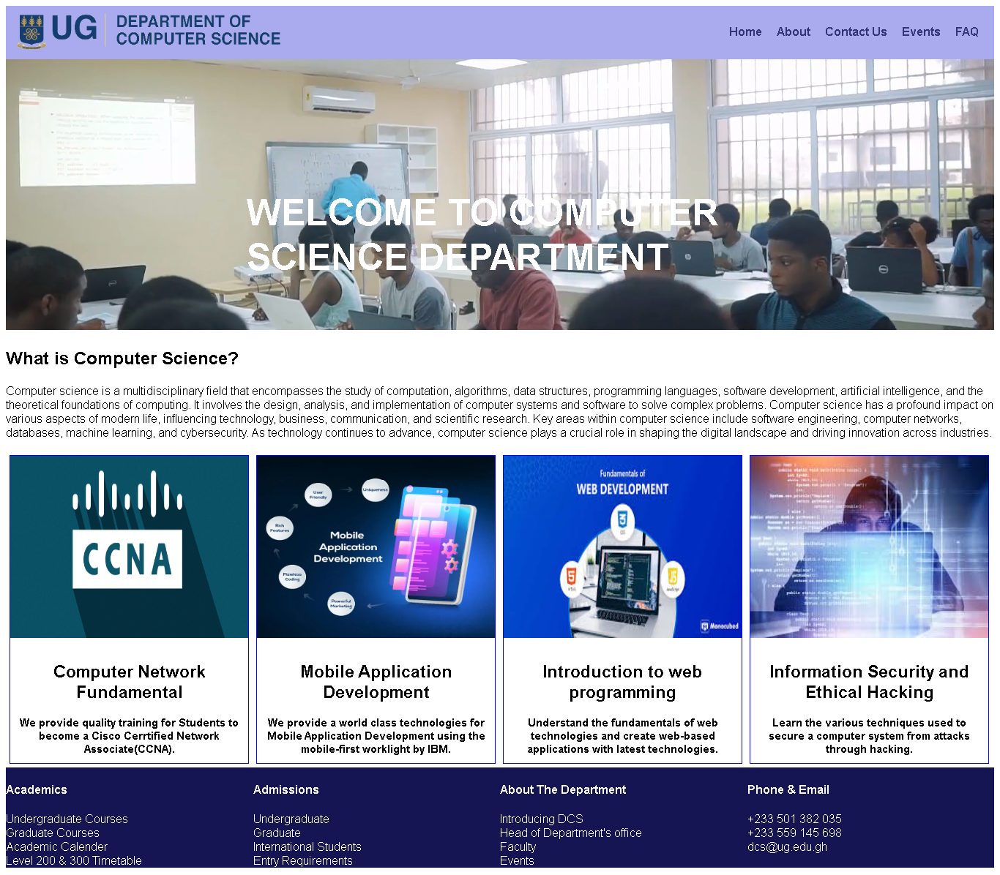
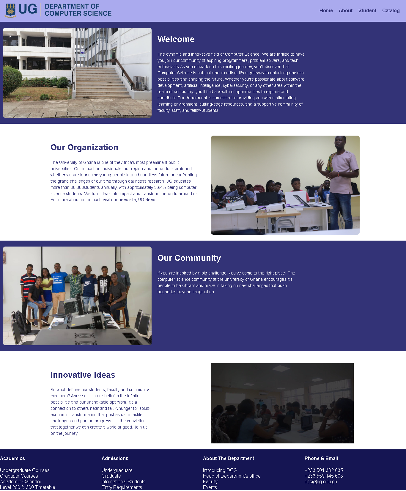
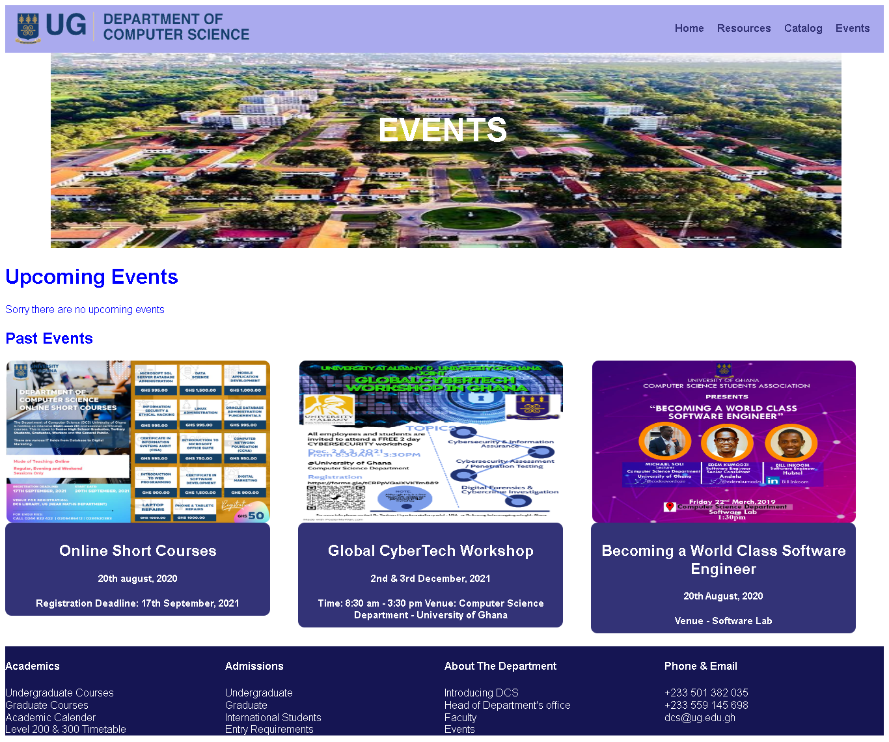
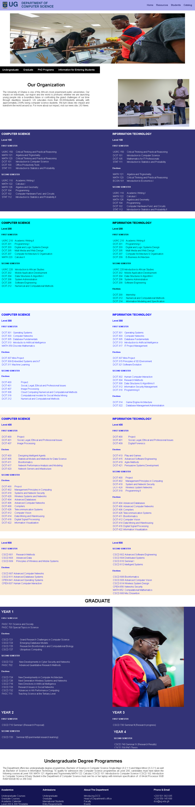
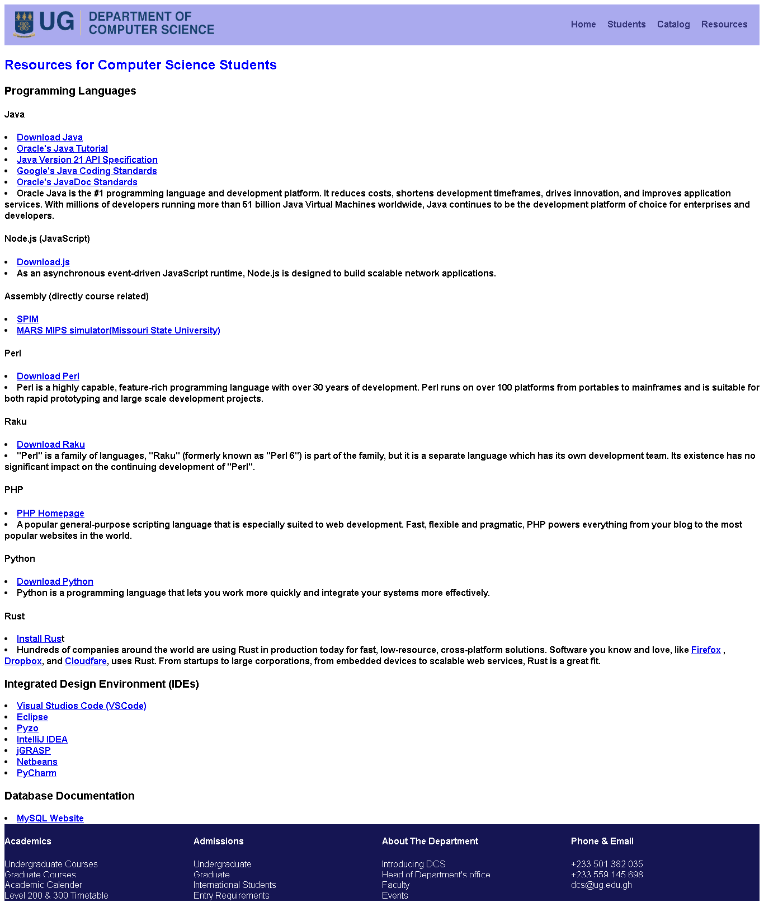
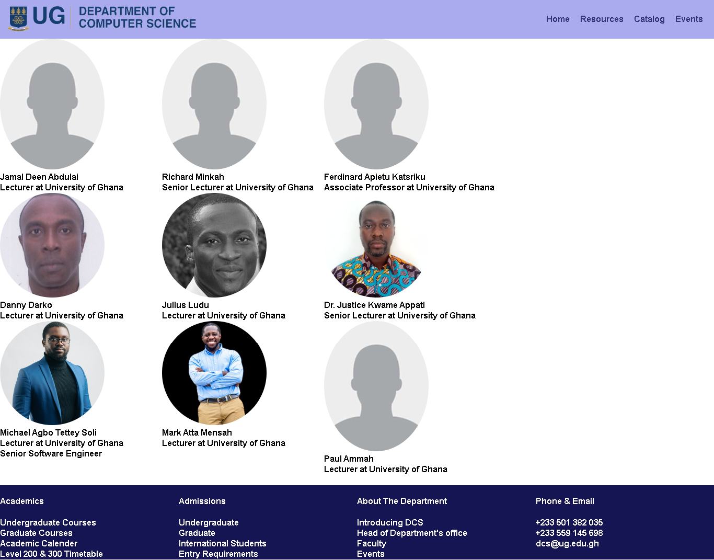
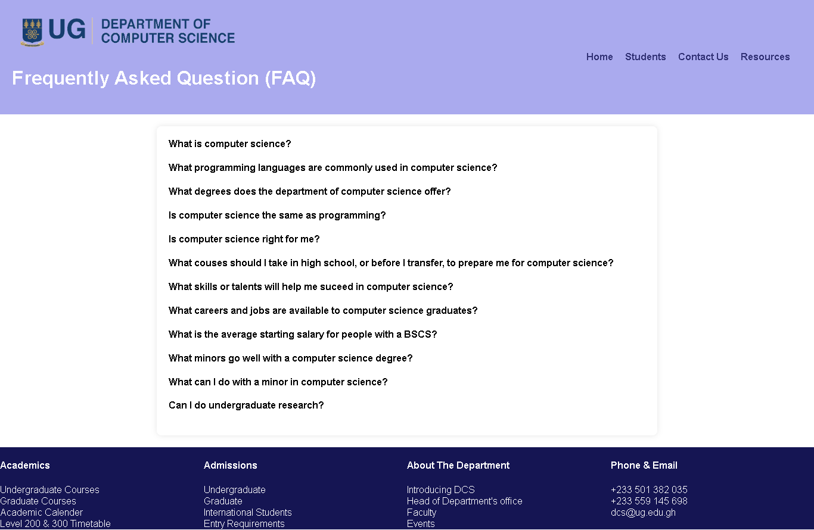
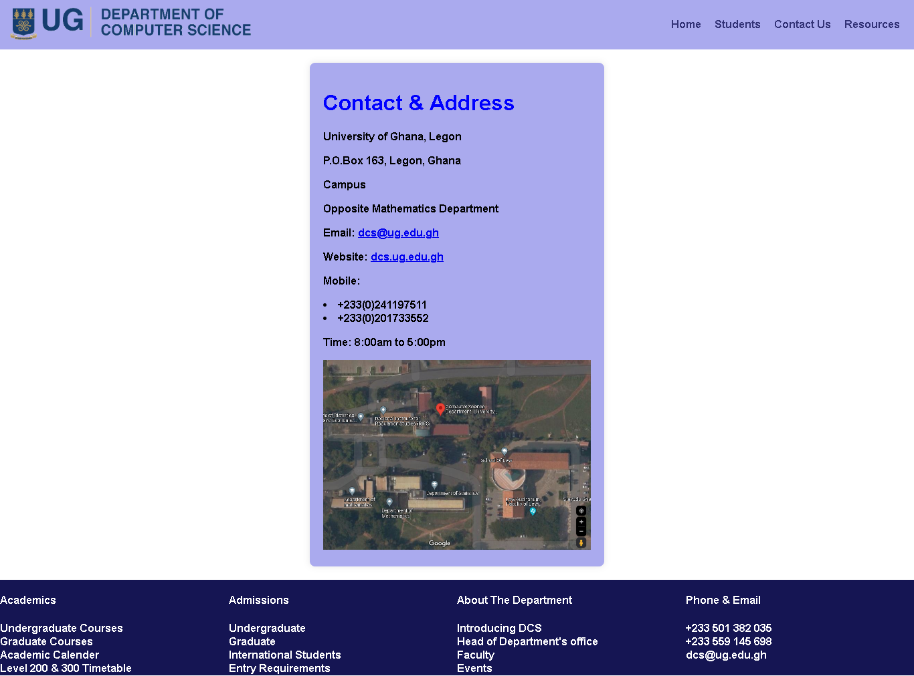

# 11253474_DCIT205_Project

# Introduction and Purpose

Welcome to the Computer Science Department website!. This website serves as means of accessing the Computer Science Department for any information concerning the course and the department. It includes , the Home page, Courses to undertake, well tarined staff, projects and many more.

## Table of Contents

1. **Home**
2. **About**
3.  **Events**
4.  **Catalog**
5. **Resources**
6. **Students**
7. **Projects**
8. **Staff**
9. **FAQ**
10. **Contact Us**

# Screenshots

#  Lessons Learned

**Through working on this project, I have gained valuable insights into able to use new tags**

# Acknowledgement

**Thanks to w3schools, and other educational websites.**
